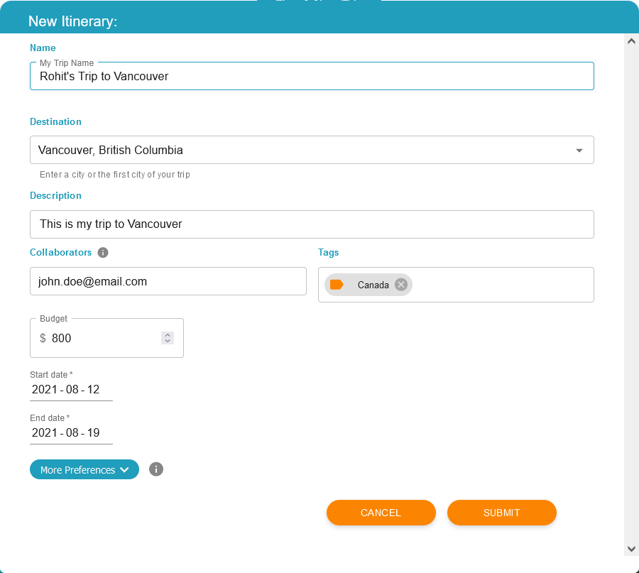
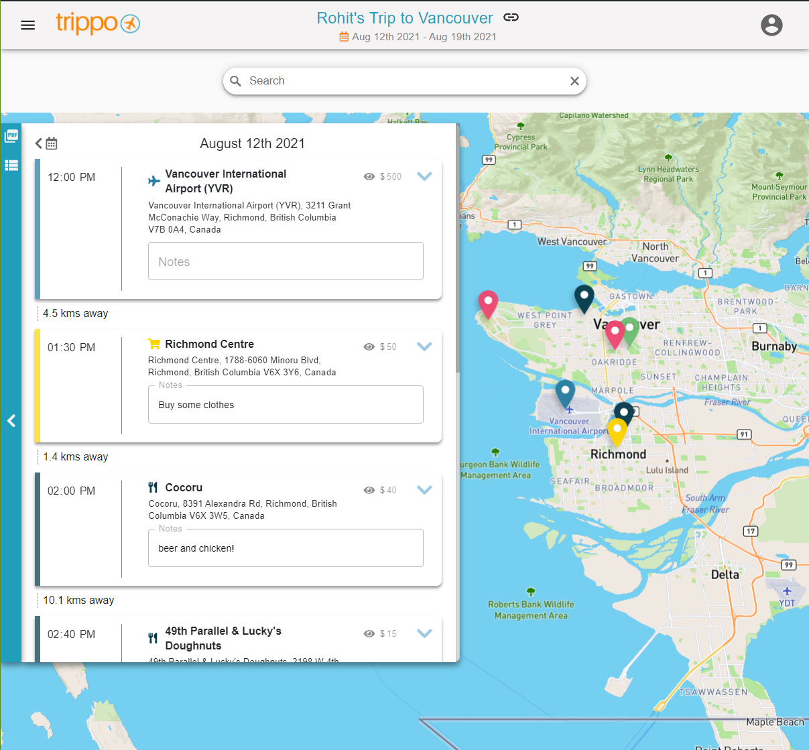
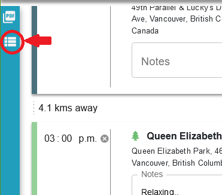
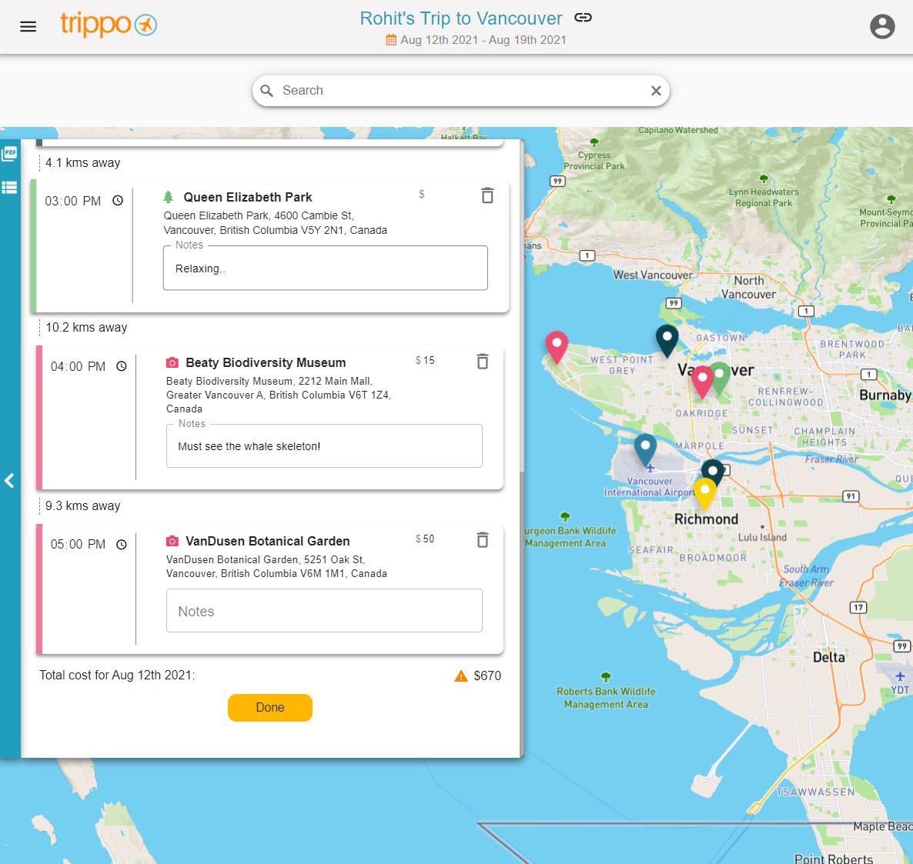
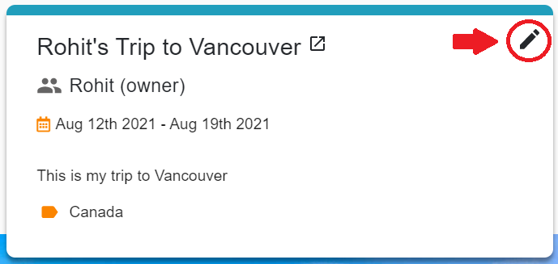

# Trippo User Documentation

> ## Table of Contents
> - [About](#about)
> - [Getting Started](#start)
> - [Adding Destinations](#add-destination)
> - [Making Changes](#make-changes)
> - [Sharing Itineraries](#share)
> - [Contact Us](#contact)

### <a name="about"> About </a>

Trippo is a collaborative, map-based, suggestive itinerary planner that allows users to create customizable itineraries while managing their expenses at each destination.

With Trippo, you can plan for your favorite destinations, add collaborators, create budgets, get Yelp® suggested activities, and more!
Say Goodbye to using traditional documents and spreadsheets, and say Hello to Trippo!

### <a name="start"> Getting Started </a>
To get started, visit [https://trippoapp.herokuapp.com/](https://trippoapp.herokuapp.com/), and click on the "Sign in with Google" button to join Trippo with your google account. 

You will be redirected to a page that looks like this: 

Click on the "Plan A New Trip" button to begin creating your itinerary.

In the new itinerary form, inputting a Name and Destination, Start date, and End date for your itinerary is required. You can also enter a small description of your trip, the google account email of a collaborator to allow them to view your itinerary, and any tags that you want to use to organize your new itinerary among others. Entering a budget allows you to keep track of your spending when you begin to add new destinations to your trip. Once you have filled out your new itinerary information, you can hit "Submit" to save your new itinerary and begin planning!

### <a name="add-destination"> Adding Destinations </a>
To begin planning your trip, you must click on the name of your itinerary. If you have multiple itineraries, it may be easier to use the search bar to find the one you want by searching for the itinerary name, or any tags that correspond with your itinerary.

After clicking on the itinerary you wish to add destinations to, you will be redirected to a map page that has a side calendar view of your trip. 

To add a new destination to your trip, use the search bar on the map page to search for your destination. 

Once you click on the pin that appears on your destination, a new form will appear. 

If you had selected a date on your side calendar, the date on the new form will correspond to that date, otherwise it will be set to the first day of your trip. You can also change this date whichever date during your trip that you want to visit this destination.

You can select the type of destination to keep your itinerary organized and colour-coordinated, select a time to visit, add any notes in the Notes field, and although not required, set a cost that you expect to spend at this destination (which will later be used to calculate your daily costs in accordance to your budget, if set). Once you have filled out your destination information, you can click the "Add" button on the bottom right of the form to save this destination to your itinerary. 

Opening the side calendar and selecting any date on your trip will open day view of any activities you have added. It will also highlight the pins on the map that correspond to the currently selected day.

You can also click on the "Itinerary master plan" button to see the full itinerary of your trip in a compact, read-only view.

### <a name="make-changes"> Making Changes </a>

To make changes to your destinations, you can open the side calendar on the map page and select a date for which you want to make a change. 

Here, you are able to click on the Edit button, which allows you to change the time, the cost, or the notes corresponding to any destination on that day, or even delete that destination. 

Make sure to click the "Done" button when you have finished making changes to your destinations, otherwise they will not be saved.

Opening the navigation bar in the top left and clicking on your Home page will bring you back to your itineraries. 

Here you can also make changes to your overall trip by clicking on the marker in the top right of your itinerary. In this form you can make edits to your existing itinerary, or even delete it. After you have made any changes, make sure to click the "Update" button to save them.

### <a name="share"> Sharing Itineraries </a>

To share your itinerary, navigate to the map page with the side calendar view. At the top of the page, you will find a link button next to the name of your itinerary. 

Clicking on that button will generate a shareable link to your itinerary. Your itinerary will not be editable through this link, and will be displayed in a read-only format. To allow others to make edits to your itinerary, you must add their google emails as collaborators.

You can also click the "Export to PDF" button on the top left of your side calendar on the map view to download a PDF version of your itinerary to share with others offline. Clicking on the "Export to PDF" button will open a pop up that will allow you to input any custom background for the PDF, but you may also choose to use the default background.

### <a name="contact"> Contact Us </a>

For any other questions or concerns regarding Trippo that have not been addressed in this documentation, feel free to contact us at [tripposupport@protonmail.com](mailto:tripposupport@protonmail.com)
